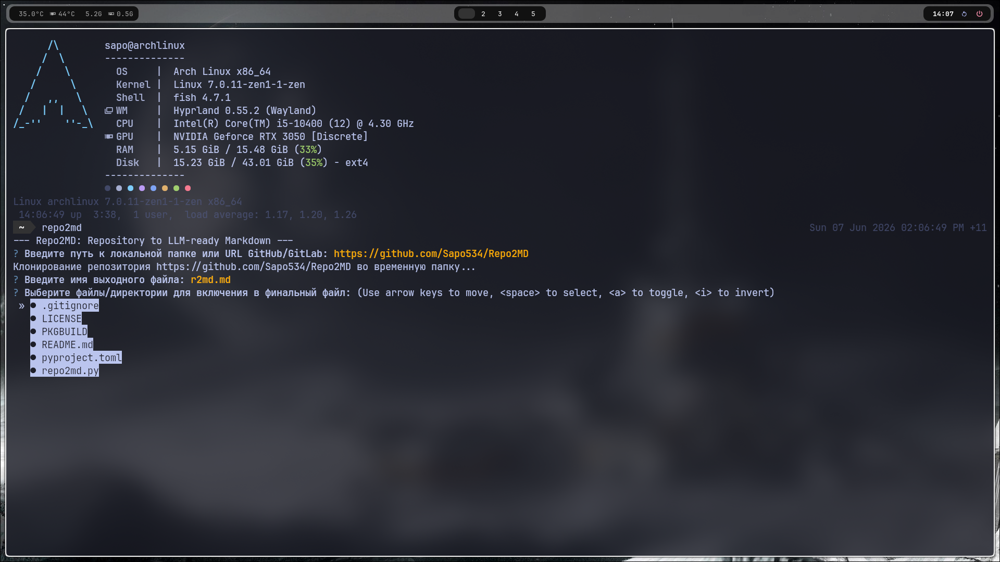
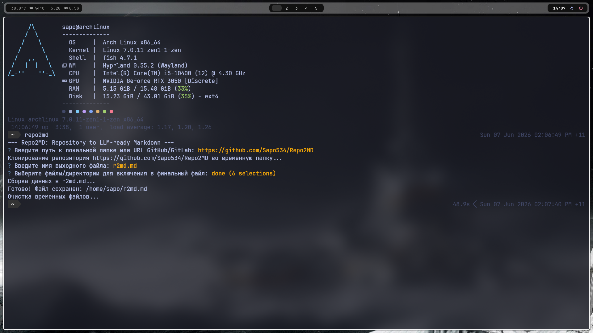
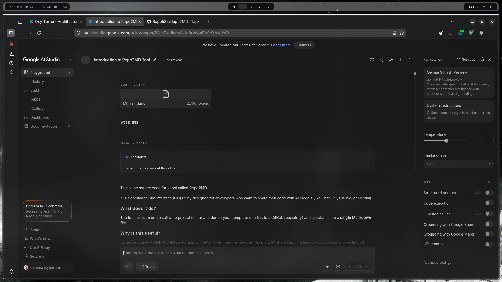

# Repo2MD

**Repo2MD** is a CLI tool for developers that compiles the entire source code of your repository (either local or from GitHub) into a single, structured Markdown file.

The tool is specifically designed to prepare context for working with **LLMs** (ChatGPT, Claude, Gemini), allowing models to "see" your entire project as a whole.

## Features

* **Interactive**: Select the files and folders you need using a user-friendly terminal menu.
* **Filtering**: Automatically ignores binary files, images, and system directories (`.git`, `node_modules`, `target`, etc.).
* **Git Integration**: Just paste the repository URL, and the tool will automatically clone it, process it, and clean up temporary files.
* **AI-Optimized Formatting**: Generates a text-based project tree and wraps code into clean markdown blocks.

## Installation

### Arch Linux

You can build the package using the provided `PKGBUILD`:

```bash
git clone https://github.com/Sapo534/Repo2MD.git
cd Repo2MD
makepkg -si

```

### Universal Installation (Python)

```bash
pip install questionary
# Download repo2md.py and run:
python repo2md.py

```

## Usage

Simply type `repo2md` in your terminal and follow the prompts:

1. Provide the folder path or repository URL.
2. Select files using the Spacebar.
3. Get your ready-to-use `.md` file.

## UX



## License

Distributed under the MIT License.
